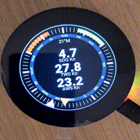

# ESPHome SignalK Component

ESPHome external component to fetch data from signalk server using websockets on arduino frameword and esp-idf framework. ESPHome is an open-source project that allows you to easily create custom firmware for ESP32 microcontrollers to integrate with home automation systems like Home Assistant. It uses a simple YAML-based configuration file to define how your device should behave.

This component allows you to connect your esp device to your signalk server. It has support to subscribe signalk paths as well as to push data to the server. The fetched data can be displayed on a custom navigational instrument made by the LVGL library, as well to activate actuators, relays etc. Also values that you get from your sensors on the esp device can easily be pushed back to the server using the signalk.publish_delta action.

The component supports esp-idf framework as well as esp arduino framework. It is also possible to use this component locally using the host: component, ESPHome will built a local binary, which you can run on your computer. No more lengthy compile process and uploading to an ESP32 device. Makes LVGL development much smoother. This has been tested with Ubuntu 24.04 and the LVGL library. See the example SDL.yaml for more details. 

Sample wind instrument view showing apparent wind angle, true wind angle, speed over ground (SOG), true wind speed (TWS), apparent wind speed (AWS) and magnetic heading using LVGL graphics library. For more information see my other project [SignalK_ESPHome_LVGL](https://github.com/batuakan/SignalK_ESPHome_LVGL)





## Installing

If using homeassistant esphome addon, just link to this repo as an external component, this will allow use of esp-idf and arduino frameworks.

Otherwise install esphome into a virtual python environment and build your project using esphome run nameofyaml.yaml

To run on local machine, ix::websockets library is required, whoch should be installed system wide, or in a path where platformio can locate it.

## Known issues and limitations

1. This component will not work with SSL, if you signalk server is sitting behind an SSL connection esp32 wont be able to connect to it yet.

2. If you use the signalk component and dont define any signalk sensors, you will get a compile error saying sensor.h was not found. Just add a sensor even if you dont use it.

```ỳaml
sensor:
  - platform: signalk
    id: environment_wind_angleApparent
    path: environment.wind.angleApparent
```

## Usage

### Connecting to the server

Connecting to the server can be achieved with the following configuration. If username and password is present the client will connect to the server using username and password, Otherwise connection and access validation will be performed through access request process.

```yaml
# Fetch ESPKHomeSignalK component from github
external_components:
  - source: github://batuakan/ESPHomeSignalK@main
    components: [ signalk ]

# Setup SK instance
signalk:
  host: 10.10.10.1 # Ip address for your server
  port: 3000 # Optional Port for signalk, defaults 3000
  username: "yourusername" #optional
  password: "yourpassword" #optional
```

### ESPHome SignalK Components

Signalk component provides the following types "core" components to send/fetch data to/from the signalk server:

1. **text_sensor** to fetch text/json based information 
2. **sensor** to access numerical data. 
3. **number** to send numerical data
4. **text** to send text data
5. **switch** creates a signalk switch

Each component must declare an id and signalk path, other optional values are:
- id: id of the sensor
- name: unique name to identify the sensor
- path: signalk path to subscribe to
- period: Default 1000
- format: Defaults to delta
- policy: Defaults to instant
- minperiod: Defaults to 200
- unit: Defines which unit the data should be converted to, default to none (No conversion).
  
Note that this compoennt doesn't know the units of the incoming value so technically it is possible to convert between unmatching values, therefore it is the developers responsiblity to check the unit of the incoming value and apply the correct unit conversion.

  Possible values are:

  `No conversion`
  none,

  `Angle`
  radians,
  degrees,
  gradians

  `Angular velocity`
  radians_per_second,
  degrees_per_second,
  degrees_per_minute,
  radians_per_second

  `Charge`
  coulumb,
  ampere_hours

  `Current`
  amperes,
  milliamperes

  `Energy`
  joules,
  kilowatt_hours

  `Flow`
  cubic_meters_per_second,
  liters_per_minute,
  liters_per_hour,
  gallons_per_minute,
  gallons_per_hour

  `Frequency`
  hertz,
  rotations_per_minute,
  kilohertz,
  megahertz,
  gigahertz

  `Length`
  meters,
  fathoms,
  feet,
  kilometers,
  nautical_miles,
  miles

  `Potential`
  volts,
  millivolts

  `Power`
  watts,
  milliwatts

  `Ratio`
  ratio,
  percentage

  `Resistance`
  ohms,
  kilo_ohms

  `Speed`
  meters_per_second,
  knots,
  kilometers_per_hour,
  miles_per_hour,

  `Temperature`
  kelvin,
  celsius,
  fahrenheit

  `Time`
  seconds,
  minutes,
  hours,
  days

  `Volume`
  liters,
  cubic_meters,
  gallons


#### Sensor Component
```yaml

# sensor for numerical data
sensor:
  - platform: signalk
    id: environment_wind_angleApparent
    path: environment.wind.angleApparent
    unit: knots

```
#### Text Sensor Component

Text sensor provides read only access to text and json based data from the SignalK server. Use text_sensor to read data that is emitted by other sources

```yaml
# text sensor for text based data
text_sensor:
  - platform: signalk
    id: name
    path: name

# use text_sensor to fetch json data and parse with the json component to extract information from it
text_sensor:
  - platform: signalk
    id: navigation_position
    path: navigation.position
    on_value:
      - lambda: |-
            json::parse_json(x, [](JsonObject root) -> bool {
                if (root["longitude"]) {
                    ESP_LOGI("json_parser", "Longitude: %f", root["longitude"].as<float>());
                    ESP_LOGI("json_parser", "Latitude: %f", root["latitude"].as<float>());
                }
                return true;
            });
```
#### Number Component

Numeric component to read/write numeric values to SignalK with meta data support.

Note: This is bit of a hack as the number component is designed in ESPHome to hold a numeric value like setting, but we can abuse that and use this component to send numeric values to SignalK using the number.set method.

```yaml

number: 
  platform: signalk
  id: test
  path: test.value
  min: 0
  max: 5000
  step: 1
  unit: "rotations_per_minute"
  meta:
    # Add your meta data here

# ---
#read the value from e.g. a sensor and forward it to signalk
on_value:
  - number.set:
      id: test
      value: !lambda "return x;"
```

#### Text Component

Similar to the number component, text is used to send/receive string data from the sinanlk server using the text.set method.

```yaml

text:
  - platform: signalk
    id: forecast_state
    path: environment.forecast.state
    mode: text
    meta:
      # Add your meta data here

# ---
#read the value from e.g. a sensor and forward it to signalk
on_value:
  - text.set:
      id: forecast_state
      value: !lambda "return x;"

```

### Meta Data

Switch, number and text components support [meta data](https://signalk.org/specification/1.7.0/doc/data_model_metadata.html), which will be passed on to the signalk server up on reconnection. Replicating the example on SK specification page, you get a meta data definition shown as below.

```yaml

  meta:
    displayName: "Port Tachometer"
    longName: "Engine 2 Tachometer"
    shortName: "Tacho"
    description: "Engine revolutions (x60 for RPM)"
    units: "Hz"
    timeout: 1
    displayScale: 
      lower: 0
      upper: 75
      type: linear
    alertMethod: ["visual"]
    warnMethod: ["visual"]
    alarmMethod: ["sound", "visual"]
    emergencyMethod: ["sound", "visual"]
    zones:
      - upper: 4
        state: alarm
        message: "Stopped or very slow"
      - lower: 4
        upper: 60
        state: normal
      - lower: 60
        upper: 65
        state: warn
        message: "Approaching maximum"
      - lower: 65
        state: alarm
        message: "Exceeding maximum"

```

### Publishing deltas

In order to send data back to server use the **signalk.publish_delta** action. publish_delta action supports string, boolean and floating values. The unit field is optional, however if applied converts from the sensors unit format to the base SI format that signalk uses, e.g. if the sensor provides temperature values in celsius they will be converted to fahrenheit while being sent to the server.


```yaml
sensor:
- platform: template
  name: "Test Fixed Sensor"
  unit_of_measurement: "°C"
  accuracy_decimals: 1
  update_interval: 5s
  lambda: |-
    return random_float() * 100.0;
  on_value:
    - signalk.publish_delta:
        path: "environment.temperature"
        unit: "celsius"
```


### PUT Requests

In order make PUT requests to the server use the **signalk.put_request** action. 
put_request action supports string, boolean and floating values. Below is an example of sending a PUT request to the autopilot to adjust course 10 degrees to port.

```yaml
- button:

    widgets:
      - label:
          text: "-10"
    on_press:
      - signalk.put_request:
          path: steering.autopilot.actions.adjustHeading
          value: -10
```

## Contributing

Contributions of all kinds are welcome! Whether it's feedback, bug reports, feature suggestions, testing, or code improvements, your input helps make the project better for everyone. Feel free to open an issue or submit a pull request—every bit of help is appreciated!

If you have created something cool using this component, please let me know, we can can share a link to your project here, or add it to the examples.

### Possible new features

1. Adding support for other esphome supported hardware types, e.g. rpi pico
1. Better schema validation
